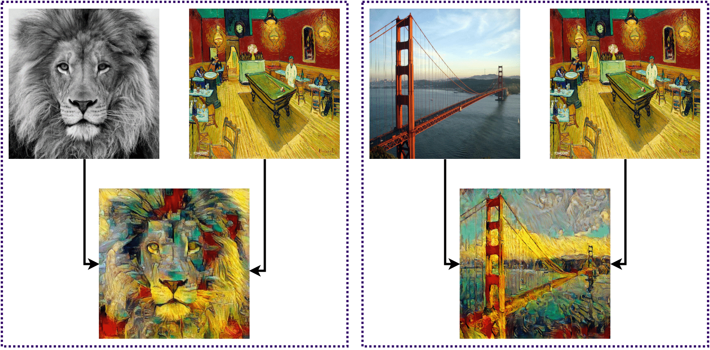

# Neural Style Transfer

[](https://pytorch.org/)
[](https://opensource.org/licenses/MIT)

## Contents

- [Neural Style Transfer](#neural-style-transfer)
  - [Contents](#contents)
  - [1. Overview](#1-overview)
  - [2. Setup Instructions](#2-setup-instructions)
  - [3. Experiments](#3-experiments)
    - [Usage](#usage)
    - [Evaluation](#evaluation)
  - [Acknowledgement](#acknowledgement)

## 1. Overview

This repo contains the code for our work **Neural Style Transfer** done as a part of *CSN-382: Machine Learning course project*.



## 2. Setup Instructions

- Clone the repo:

    ```.bash
    git clone https://github.com/Bisht13/NST.git
    cd NST
    ```

- Create a conda environment:

    ```.bash
    conda env create -f environment.yml
    conda activate nst
    ```

## 3. Experiments

### Usage

- Copy content images to the default content image directory: /data/content-images/
- Copy style images to the default style image directory: /data/style-images/
- Run python neural_style_transfer.py --content_img_name <content-img-name> --style_img_name <style-img-name>

### Evaluation

- We use the predictions from the [AdaIn-Style](https://github.com/xunhuang1995/AdaIN-style) method proposed in [Arbitrary Style Transfer in Real-time with Adaptive Instance Normalization](https://arxiv.org/abs/1703.06868) as ground truths while evaluating the performance of our method.

- Install [`image-similarity-measures`](https://github.com/up42/image-similarity-measures):

    ```.bash
    pip install image-similarity-measures[speedups]
    ```

- Execute the following command to calculate the `PSNR`, `SSIM` and `RMSE` scores:

    ```.bash
    sh metrics.sh [path-to-gt] [path-to-our-prediction]
    ```

## Acknowledgement

This repo is a part of our course project for CSN-382: Machine Learning under [Dr. R. Balasubramanian](https://faculty.iitr.ac.in/cs/bala/) at CSE Department, IIT Roorkee. The code is open-sourced under the MIT License.
